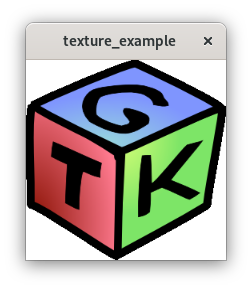

# Load a texture with Gtk and openGL

## Description
Example generated by copilot to load a texture

## Build
    gcc -o texture_example texture_example.c `pkg-config --cflags --libs gtk+-3.0 epoxy` -lm

    g++ -o texture_example texture_example.cpp `pkg-config --cflags --libs gtkmm-3.0 epoxy` -lGL

## Run

./texture_example

## Results

